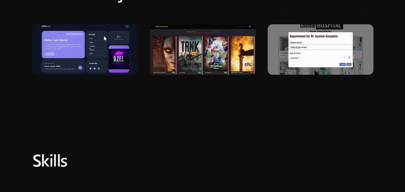

# 🎨 Creative Portfolio - HTML & CSS

A modern and responsive personal portfolio website. Built with clean design and interactive elements, featuring mobile-first approach.

## 📱 Demo



_Live demo showcasing the interactive portfolio experience_

## ✨ Features

- 📱 **Fully Responsive Design** - Perfect display across all devices
- 🎯 **Interactive Project Cards** - Visual experience with hover effects
- 🎨 **Modern CSS Grid Layout** - Flexible and responsive structure
- ⚡ **Smooth Transitions** - Fluid animation effects
- 🛠️ **Skills Section** - Interactive presentation of skills
- 🌗 **Clean & Minimal Design** - Professional and clean aesthetics
- 🎪 **Hover Animations** - Visual feedback for user interactions

## 🛠️ Technologies Used

- **HTML5** - Semantic markup and accessibility
- **CSS3** - Modern CSS features
  - CSS Grid & Flexbox
  - CSS Variables (Custom Properties)
  - CSS Transitions & Hover Effects
  - Responsive Media Queries
  - Modern Layout Techniques
- **Clean Architecture** - Modular and maintainable CSS structure

## 📁 Project Structure

```
creative-portfolio-html-css/
│
├── index.html              # Main HTML file
├── assets/
│   ├── demo/              # Demo files
│   │   └── demo.gif       # Portfolio demo video
│   └── images/            # Project images
│       ├── Project 1.png
│       ├── Project 2.png
│       └── Project 3.png
├── css/
│   ├── main.css           # Main stylesheet
│   ├── reset.css          # CSS reset
│   ├── variables.css      # CSS variables
│   ├── layout.css         # Layout styles
│   └── components.css     # Component styles
└── README.md              # Project documentation
```

## 🚀 Installation & Usage

1. **Clone the repository:**

   ```bash
   git clone https://github.com/yourusername/creative-portfolio-html-css.git
   ```

2. **Navigate to project directory:**

   ```bash
   cd creative-portfolio-html-css
   ```

3. **Open in browser:**
   ```bash
   # With Live Server extension (recommended)
   # or directly open index.html in your browser
   ```

## 🎨 Customization

### Editing CSS Variables

Customize color palette and other variables in `css/variables.css`:

```css
:root {
  --primary-color: #your-color;
  --secondary-color: #your-color;
  --accent-color: #your-color;
}
```

### Project Images

Add your own project images to `assets/images/` folder and update references in `index.html`.

### Content Editing

Update your personal information, projects, and skills in the `index.html` file.

## 📱 Responsive Design

- **Desktop:** 1200px and above
- **Tablet:** 768px - 1199px
- **Mobile:** 320px - 767px

Optimized for the best user experience across all devices.

## 🔧 Technical Details

- **CSS Grid:** Modern and flexible layout system
- **Flexbox:** For component alignment
- **CSS Variables:** Consistent color palette and spacing
- **Smooth Transitions:** 300ms transition duration
- **Hover Effects:** Interactive user experience
- **Mobile First:** Responsive design approach

## 🌟 Key Highlights

- Clean and modern design aesthetics
- Semantic HTML5 structure
- CSS3 animations and transitions
- Cross-browser compatibility
- Performance optimized
- SEO friendly structure

## 🤝 Contributing

1. Fork the project
2. Create your feature branch (`git checkout -b feature/amazing-feature`)
3. Commit your changes (`git commit -m 'feat: Add amazing feature'`)
4. Push to the branch (`git push origin feature/amazing-feature`)
5. Open a Pull Request

## 📄 License

This project is licensed under the MIT License - see the [LICENSE](LICENSE) file for details.

## 🙋‍♂️ Contact

If you have any questions about this project, feel free to reach out:

- 📧 Email: [your-email@example.com](mailto:your-email@example.com)
- 💼 LinkedIn: [linkedin.com/in/yourprofile](https://linkedin.com/in/yourprofile)
- 🌐 Portfolio: [yourwebsite.com](https://yourwebsite.com)

---

⭐ If you found this project helpful, please consider giving it a star!
